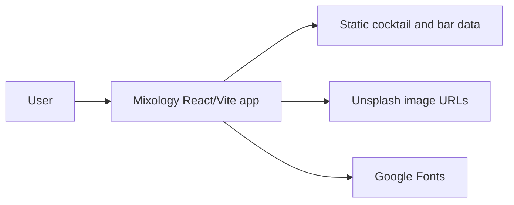
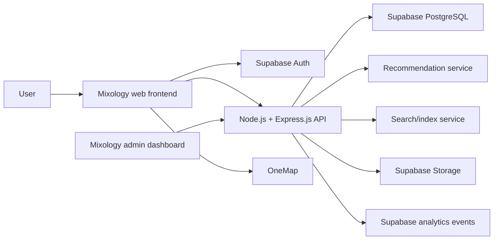
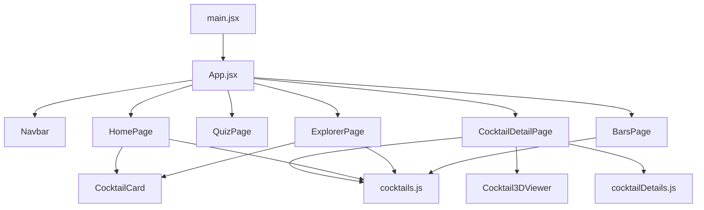
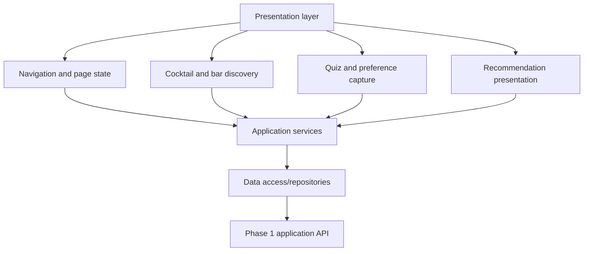
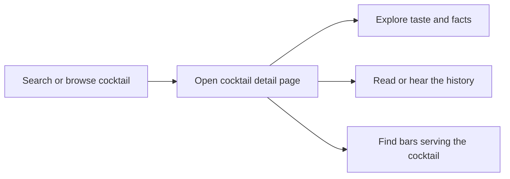
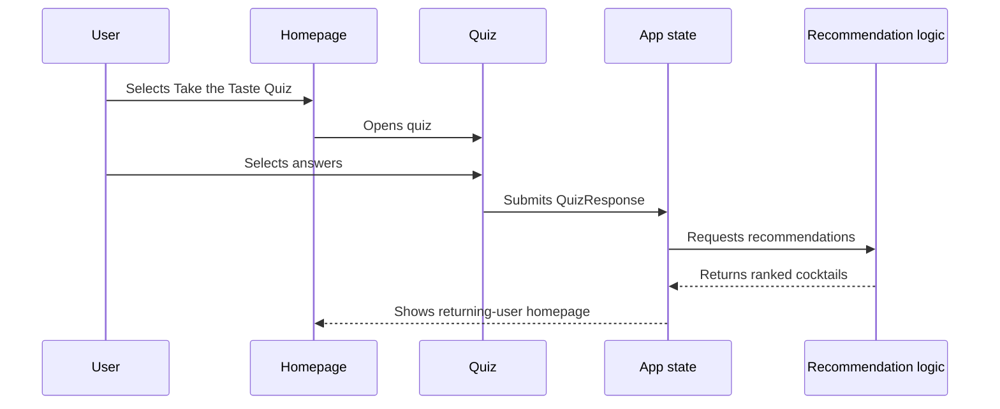
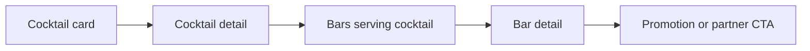
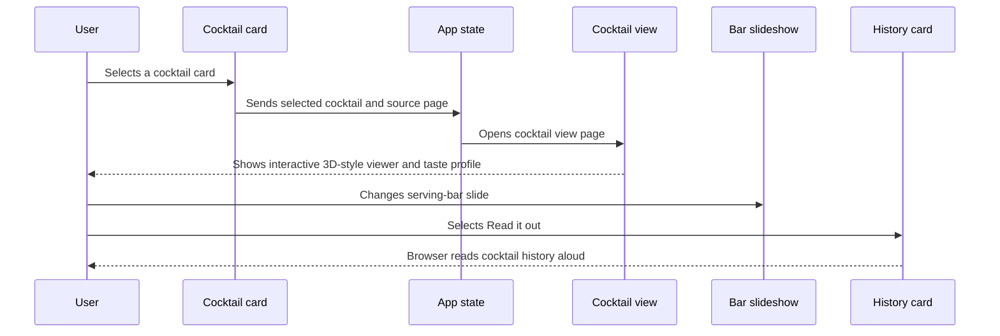

# Mixology — High-Level Design

> **Status:** PHASE 1
>
> **Version:** 1.3
>
> **Date:** 2026-08-17
>
> **Related document:** [Agent Handoff](./AGENT_HANDOFF.md)

## 1. Document purpose

This document describes the high-level product and system design for Mixology, a cocktail-discovery experience focused on Singapore.

## 2. Product summary

Mixology is an interactive cocktail education and discovery platform. Its primary purpose is to help users understand a cocktail’s history, origin, taste, spirit, strength, occasion, and cultural context through an engaging detail page. It then helps users discover where to experience that cocktail in real life.

The taste quiz and recommendation system support the learning experience by helping users decide which cocktail to explore next. Bar discovery, partner promotions, and analytics are supporting capabilities around the core cocktail-education experience.

The product direction is an elevated, editorial alternative to a generic nightlife directory:

- Dark, high-end visual language.
- Cocktail education driven by history, taste, origin, and context.
- Interactive visual exploration of each cocktail.
- Discovery tools that help users find cocktails to learn about.
- Direct relationships between cocktails and bars.
- Personalization after the taste quiz.
- Dedicated visibility for partner venues and promotions.

## 3. Goals

### Product goals

- Help users understand cocktails deeply through history, origin, taste, and detailed facts.
- Make the cocktail detail page the primary product experience.
- Make cocktail knowledge understandable for beginners and useful for experienced drinkers.
- Make cocktail history accessible through both reading and optional read-aloud narration.
- Help users discover a suitable cocktail to learn about next.
- Connect cocktails to the venues that serve them after the user has explored the drink.
- Give returning users useful personalized recommendations.
- Create a clear but restrained placement for partner bars.
- Keep bar profiles, cocktail listings, and promotions accurate through Mixology-managed data.
- Provide a future internal Mixology admin page for easier bar-detail management.
- Establish a foundation that can evolve from a static prototype into a production application.

### Technical goals

- Keep the front end modular and easy to extend.
- Make filtering, search, quiz answers, and recommendations explicit domain concepts.
- Treat cocktail history, taste descriptions, origin, and detailed tasting facts as first-class product data.
- Keep current prototype behavior clearly distinguishable from future production behavior.
- Establish a backend and database as the Phase 1 source of truth for product data and user activity.
- Support responsive, keyboard-accessible, and maintainable UI patterns.

## 4. Scope

### Current prototype scope

The current repository contains:

- Homepage for new visitors.
- Dedicated four-step taste quiz.
- Returning-user homepage state after quiz completion.
- Cocktail Explorer page.
- Static cocktail cards.
- Cocktail view page opened from cocktail cards.
- Interactive CSS-based 3D-style cocktail viewer.
- Cocktail taste profile and history view.
- Cocktail identity and tasting facts including origin, drinker profile, spirit, strength, and occasion.
- Serving-bar slideshow for each cocktail.
- Browser read-aloud support for cocktail history.
- Cocktail filtering for some filter types.
- Global search that navigates to the Explorer.
- Bars page with a partner-bar carousel.
- Stylized Singapore map with bar pins and previews.
- Static cocktail and bar data.

Relevant implementation files include:

- [`src/App.jsx`](../src/App.jsx)
- [`src/components/Navbar.jsx`](../src/components/Navbar.jsx)
- [`src/components/CocktailCard.jsx`](../src/components/CocktailCard.jsx)
- [`src/pages/HomePage.jsx`](../src/pages/HomePage.jsx)
- [`src/pages/QuizPage.jsx`](../src/pages/QuizPage.jsx)
- [`src/pages/ExplorerPage.jsx`](../src/pages/ExplorerPage.jsx)
- [`src/pages/CocktailDetailPage.jsx`](../src/pages/CocktailDetailPage.jsx)
- [`src/pages/BarsPage.jsx`](../src/pages/BarsPage.jsx)
- [`src/components/Cocktail3DViewer.jsx`](../src/components/Cocktail3DViewer.jsx)
- [`src/data/cocktails.js`](../src/data/cocktails.js)
- [`src/data/cocktailDetails.js`](../src/data/cocktailDetails.js)

### Phase 1 target scope

Phase 1 will turn the current prototype into an interactive cocktail-education and discovery experience. The capabilities are grouped by product priority.

#### Core cocktail-education experience

- URL-based cocktail detail routing.
- First-class cocktail history, origin, taste tags, tasting notes, multiple spirits, five-level alcoholic intensity, multiple occasions, and drinker information.
- Interactive 3D-style cocktail viewer.
- Browser read-aloud support for cocktail history.
- Protected serving-bar relationships shown after the user explores the cocktail and authenticates.

#### Supporting discovery experience

- Complete Explorer filtering and sorting.
- Search that opens the relevant cocktail or bar directly.
- Account creation and login through Supabase Auth for personalized features.
- Saved cocktails for authenticated customers.
- Recommendation scoring based on quiz answers and approved user activity.
- Persistent user preferences and quiz history.

#### Supporting real-world experience

- Bar detail pages.
- Real bar coordinates and OneMap integration.
- Partner promotions and featured placements.

#### Product operations

- Lightweight, privacy-conscious analytics for approved product events.
- Mixology-admin analytics dashboard backed by Supabase event data.

Users can browse and learn about public cocktail content without logging in. Login is required before taking the quiz, saving cocktails they like, or viewing the bars that serve a cocktail. The login requirement protects personalized and bar-discovery features while keeping the educational cocktail content public.

Phase 1 partner promotions may be managed through static data or Mixology administration. There is no bar-owner self-service dashboard in Phase 1. User reviews and user ratings are not part of Phase 1.

The Phase 1 analytics event list must be agreed with stakeholders before implementation. Approved events will be stored in Supabase and displayed in a Mixology-admin analytics dashboard. Session recording, advertising tracking, and detailed behavioral profiles are not included in the initial analytics scope.

### Later-phase or open items

- A true model-based 3D viewer using technologies such as Three.js or WebGL.
- Advanced analytics reporting, segmentation, and exports.
- More advanced personalization and cross-session behavioral modeling.

### Future internal bar-management goal

A future goal of Mixology is to create an internal administration page for the Mixology team to manage bar information more efficiently. This may include:

- Updating bar profiles, descriptions, images, neighborhoods, and vibes.
- Updating the cocktails served by each bar.
- Managing featured placement and promotions.
- Reordering or arranging bar-detail content through a drag-and-drop interface.
- Publishing or hiding bar information.

There will be no bar-owner account or bar-owner self-service page in Phase 1. The future management page is for the Mixology team, not for partner bars to access directly.

## 5. Post-Phase 1 scope

The following capabilities are intentionally excluded from Phase 1. They are planned for review and potential implementation after Phase 1 is completed:

- Cocktail ordering or delivery.
- Table reservations.
- Payments or subscriptions.
- User-generated cocktail recipes.
- Social feeds or direct messaging.
- An internal drag-and-drop bar-management page.
- Advanced partner promotion scheduling and management.
- Full customer relationship management for bars.
- Alcohol sales or age-verification workflows.

Phase 1 will still support basic partner visibility, featured placement, and static or Mixology-admin-managed promotions. The post-Phase 1 scope refers to advanced partner tools and business workflows.

> **Post-Phase 1 decision:** After Phase 1 is completed, review this list with stakeholders and prioritize the features that should become Phase 2 requirements. Items involving payments, reservations, alcohol sales, or age verification require additional product, security, and legal review before implementation.

## 6. Users and use cases

### Cocktail learner

1. Browses the Explorer or searches for a cocktail.
2. Opens the cocktail detail page.
3. Explores the interactive visual presentation.
4. Reads the taste profile, origin, facts, and history.
5. Uses read-aloud if preferred.
6. Signs in if needed and opens the protected slideshow of bars that serve the cocktail.

### New visitor

1. Opens the Mixology homepage.
2. Reads the value proposition.
3. Creates an account or signs in through Supabase Auth.
4. Takes the taste quiz.
5. Receives a set of personalized cocktail recommendations.
6. Opens the Explorer or finds a bar serving a suitable cocktail.

### Returning visitor

1. Opens the homepage.
2. Signs in if a valid session is not already available.
3. Sees previously selected or recommended cocktails.
4. Searches for a cocktail or bar.
5. Browses bars near a relevant neighborhood.
6. Uses a recommendation to decide where to go.

Visitors may browse public cocktail and bar content without logging in, but they cannot take the taste quiz, save preferences, or receive account-based personalized recommendations until they authenticate.

### Cocktail-focused visitor

1. Opens the Explorer.
2. Filters by flavor, spirit, occasion, strength, or experience level.
3. Sorts the results.
4. Opens a cocktail detail page.
5. Finds a bar that serves the cocktail.

### Bar-focused visitor

1. Opens the Bars page.
2. Browses featured partner bars.
3. Selects a bar on the map.
4. Views the bar details, vibe, promotions, and served cocktails.

### Partner bar

1. Provides venue, cocktail, and promotion information to Mixology.
2. Is reviewed and approved as a partner by the Mixology team.
3. Receives a partner or featured listing managed by Mixology.
4. Receives visibility through relevant cocktail discovery flows.

During Phase 1, Mixology manages partner-bar profiles, featured placement, and promotions on behalf of partner bars. Partner bars do not sign in to Mixology or edit the displayed information. A future internal administration page may make this work easier for the Mixology team.

### Mixology administrator

1. Signs in through an administrative account.
2. Creates, updates, and publishes partner-bar profiles and promotions through Mixology-managed tools or data workflows.
3. Controls featured placements and promotion visibility.
4. Views approved analytics in the Mixology administration dashboard.

## 7. System context

### Current prototype context



The current application has no backend, database, authentication layer, real search service, or real map provider. The prototype already supports navigation between its main screens and cocktail view; page navigation and user state are currently held in React state.

### Phase 1 target context



Phase 1 requires the backend, database, authentication, and managed media storage. The current static data files remain useful as development fixtures and migration seed data, but they will not be the production source of truth. Mixology will build the initial analytics dashboard for administrators instead of depending on a third-party analytics dashboard.

## 8. High-level architecture

### Current front-end architecture

The current implementation is a single React application with local state:



### Phase 1 logical architecture

Phase 1 should separate UI concerns from domain behavior and data access:



The frontend should not own the production source of truth. Static data may remain as local fixtures for development, while the Phase 1 application uses API-backed repositories for cocktails, bars, promotions, users, preferences, recommendations, search, and analytics events.

## 9. Major system responsibilities

### Application shell

- Mount the React application.
- Provide global styling and theme.
- Render the active page.
- Own or provide shared navigation state.

### Navigation

- Navigate between Home, Quiz, Explorer, and Bars.
- Navigate to the current cocktail view page from Home and Explorer cards.
- Support Phase 1 URL-based cocktail and bar detail routes.
- Preserve or intentionally reset search and filter state.

### Cocktail discovery

- Display cocktail cards.
- Open a cocktail view page from a selected cocktail card.
- Present taste tags, origin, drinker profile, multiple spirits, five-level alcoholic intensity, and multiple occasions.
- Present the bars that serve the selected cocktail only after the customer is authenticated.
- Allow authenticated customers to save cocktails they like.
- Present cocktail history and optional browser read-aloud support.
- Search cocktails by relevant text fields.
- Filter by supported attributes.
- Sort by popularity, name, or newest.
- Show a meaningful empty state.

### Quiz and preferences

- Capture spirit, taste-tag, strength, and occasion preferences.
- Validate that each question is answered.
- Produce a structured quiz-response object.
- Pass answers into recommendation logic.

### Recommendations

- Match quiz responses to cocktail attributes.
- Include quiz matches, popularity, and approved user activity.
- Explain the recommendation context to the user.

### Bar discovery

- Display partner bars.
- Display all bars on a map or map-like view.
- Associate bars with cocktails.
- Display promotions and partner status.
- Support featured placement and clearly labeled partner content.
- Validate whether a promotion is active based on its date and time range.

### Data management

- Provide cocktail, bar, promotion, and user preference data.
- Store cocktail history, origin, taste description, taste tags, tasting notes, multiple spirits, five-level alcoholic intensity, multiple occasions, drinker profile, and read-aloud content as first-class cocktail-detail data.
- Store serving-bar relationships as first-class data so users can move from learning about a cocktail to finding where to experience it.
- ZR will provide the initial cocktail content and images; Phase 1 will not introduce a separate cocktail-content review workflow.
- Provide promotion status, schedule, call-to-action, and terms for Phase 1 partner offers.
- Hide data-source details from presentation components.
- Use the Phase 1 API and database as the production source of truth.
- Support static fixtures only for local development, testing, or initial data seeding.

### Backend and database

- Expose secure API endpoints for cocktails, bars, promotions, users, preferences, recommendations, search, and analytics events.
- ZR owns the Node.js/Express.js backend API and acts as the integration owner for the shared application shell, API contracts, and branch integration.
- CX defines the API requirements for the homepage, quiz, customer authentication, and admin analytics features.
- LY defines the API requirements for bars, bar details, OneMap data, and promotions.
- Verify Supabase Auth sessions before allowing quiz submission, saved-cocktail requests, serving-bar requests, or personalized user-data requests.
- Validate and authorize data changes before writing them to the database.
- Store persistent user preferences and approved discovery activity.
- Store saved-cocktail relationships for authenticated customers.
- Store partner-bar profiles and promotion schedules.
- Use Supabase Storage for Mixology-managed cocktail, bar, and promotion images.
- Provide an administrator-only dashboard for approved discovery and promotion analytics.
- Provide a data-access boundary so frontend components do not depend directly on database details.
- Support migrations, backups, and environment-specific configuration.

## 10. Core domain concepts

The main business entities are:

- `User`
- `Cocktail`
- `CocktailDetailMetadata`
- `Bar`
- `Promotion`
- `QuizResponse`
- `Recommendation`
- `SavedCocktail`
- `UserActivity`
- `PartnerProfile`

High-level relationships:

```text
User submits QuizResponse
QuizResponse is used to generate Recommendations
Recommendation points to Cocktail
User saves Cocktail through SavedCocktail
Cocktail is served by Bar
Cocktail has CocktailDetailMetadata
Bar may have PartnerProfile
PartnerProfile may publish Promotion
UserActivity may influence Recommendation
```

`CocktailDetailMetadata` is core product content, not optional decoration. It provides the educational material that makes the cocktail detail page useful.

## 11. Key workflows

### Primary cocktail-learning flow



### Quiz-to-recommendation flow



### Cocktail-to-bar discovery flow



### Current cocktail view flow



## 12. External dependencies

### Current dependencies

- React and React DOM.
- Vite.
- Tailwind CSS v4 integration.
- Google Fonts: Fraunces and Inter.
- Unsplash image URLs.
- Browser Web Speech API for optional history read-aloud.

### Phase 1 planned dependencies

- Node.js runtime with Express.js for the Phase 1 application API.
- Supabase-hosted PostgreSQL for the production database and database migration workflow.
- Supabase Auth for account creation, login, and authenticated sessions.
- Supabase Storage for Mixology-managed cocktail, bar, and promotion images.
- OneMap for the real-location map.

### Later or optional dependencies

- Search/index provider if the catalog grows beyond what the Phase 1 API and database can query efficiently.
- True 3D/WebGL rendering library and model assets.

> **TODO:** Confirm the Node.js and Express.js versions, Supabase environments, OneMap configuration, hosting provider, and deployment configuration before implementation begins.

## 13. Non-functional requirements

### Performance

- Load the primary homepage content quickly.
- Optimize cocktail and bar images.
- Lazy-load below-the-fold imagery where appropriate.
- Avoid blocking the main experience on map or recommendation services.

### Accessibility

- Support keyboard navigation.
- Use semantic controls and labels.
- Provide visible focus states.
- Provide meaningful image alt text.
- Maintain sufficient color contrast.
- Make map pins and popups accessible without hover.
- Make the cocktail viewer usable with pointer controls and reset behavior.
- Provide a visible fallback when browser speech synthesis is unavailable.

### Responsive behavior

- Support desktop, tablet, and mobile layouts.
- Collapse Explorer filters into a mobile filter control.
- Stack homepage content on narrow screens.
- Ensure cards, buttons, and quiz options remain usable with touch input.

### Security and privacy

- Avoid collecting unnecessary personal information.
- Protect any future user preferences and activity data.
- Validate and sanitize future partner-managed content.
- Keep secrets and API keys out of the client bundle.
- Use Supabase Auth for account creation, login, session management, and authenticated API access.
- Require customer authentication before quiz submission, preference storage, saving cocktails, viewing serving bars, or personalized recommendations.
- Authorize internal Mixology administration separately from ordinary customer access.
- Protect database credentials and service-to-service secrets.
- Do not enable analytics collection until the event list and privacy expectations are approved.
- Do not use session recording, advertising profiles, or unnecessary identity tracking in Phase 1.

### Analytics and measurement

Phase 1 will use a small set of approved events to understand whether the core discovery flow is working. Candidate events include:

- `quiz_completed`
- `cocktail_viewed`
- `bar_viewed`
- `recommendation_selected`
- `serving_bar_selected`
- `promotion_clicked`
- `search_used`
- `history_read_aloud`

The event list, data fields, and privacy expectations must be discussed with stakeholders before implementation. The approved events will be stored in Supabase and shown in a Mixology-built administrator dashboard. Advanced reporting, segmentation, and exports are later-phase work.

### Reliability

- Provide fallback UI for failed image, map, and API requests.
- Handle empty catalog and empty partner-bar states.
- Keep core cocktail discovery usable if optional integrations fail.
- Show users a generic `Something went wrong.` message for unexpected API failures while keeping technical details in server logs.
- Back up persistent data and support database migrations.

## 14. Deployment overview

The current project is a Vite frontend application. The existing commands are used to develop, build, preview, and format the frontend.

For Phase 1, Mixology will have three production parts:

1. A web frontend that users access through their browser.
2. A Node.js and Express.js API that handles business logic and protects private operations.
3. A Supabase PostgreSQL database that stores Mixology data.

The frontend and API should be deployed separately. This keeps database credentials and server-side business rules away from the browser.

Before the production release, the team must finalize:

- Database migration procedures.
- Database backup and restore procedures.
- Frontend deployment.
- API deployment.
- Environment variables and secrets.
- Domain configuration.
- Release and rollback procedures.

> **TODO:** Decide the frontend hosting provider, API hosting provider, deployment pipeline, domain, environment variables, and release process.

## 15. Current limitations

The current prototype does not yet provide:

- Persistent user accounts or quiz history.
- Backend or database integration.
- Fully functional recommendation scoring.
- Bar detail pages.
- Complete occasion, strength, and experience filtering.
- Real map data or marker clustering.
- Real search-result routing.
- URL-based routing for cocktail views.
- Saved-cocktail collection and protected serving-bar access.
- A true model-based 3D cocktail viewer; the current viewer is CSS-based.
- Phase 1 recommendation scoring and persistent preferences.
- Phase 1 lightweight analytics; the event list still requires stakeholder approval.

These limitations should remain visible until the corresponding work is completed.

## 16. Risks and open decisions

| Decision | Current position | Owner | Status |
|---|---|---|---|
| Product focus | Prototype mixes discovery, recommendations, and bar content | Cocktail education and detail page are the Phase 1 primary experience | Confirmed |
| Backend and database | Static data today | Node.js/Express.js API with Supabase PostgreSQL as the Phase 1 production source of truth | Confirmed |
| Backend technology | Not applicable in prototype | Node.js runtime and Express.js API framework; API hosting remains open | Confirmed |
| User accounts | Not implemented | Supabase Auth for customers; admin access is restricted to Mixology staff; no bar-owner role | Confirmed |
| Recommendation method | Fixed prototype slices today | Phase 1 scoring from quiz answers and user activity | Planned |
| Search behavior | Explorer filtering today | Phase 1 direct cocktail/bar routing | Planned |
| Map provider | Stylized CSS map today | OneMap for Phase 1 real coordinates | Confirmed |
| Cocktail view routing | Local `cocktail` page state today | Phase 1 URL-based routing | Planned |
| Cocktail 3D viewer | CSS-based interactive presentation | Keep CSS viewer in Phase 1; true model later | Planned |
| History read-aloud | Browser Web Speech API | Keep as optional Phase 1 enhancement | Planned |
| Partner management | Static partner flag and promo | Phase 1 displayed/admin-managed bar information; future internal drag-and-drop admin page | Planned |
| Saved cocktails | Not implemented | Authenticated customers can save and revisit cocktails | Planned |
| Analytics events | Not implemented | Approve event list, store events in Supabase, and provide a CX-owned Mixology-admin dashboard | Pending approval |
| Advanced analytics | Not implemented | Later-phase reporting, segmentation, and exports | Later |
| Production hosting | TODO | Hosting provider to be decided | Open |

## 17. Approval checklist

- [ ] Product goals confirmed.
- [ ] Scope and non-scope confirmed.
- [ ] Current versus target architecture confirmed.
- [ ] Phase 1 backend, database, data ownership, and ZR integration-owner decisions confirmed.
- [ ] Phase 1 API boundaries and deployment model confirmed.
- [ ] Search and recommendation direction confirmed.
- [ ] OneMap configuration and production hosting provider confirmed.
- [ ] Supabase Auth and Supabase Storage configuration confirmed.
- [ ] No bar-owner sign-up, sign-in, or role is included in Phase 1.
- [ ] Phase 1 partner-promotion rules confirmed.
- [ ] Phase 1 analytics events and privacy expectations approved.
- [ ] Advanced analytics and true model-based 3D viewer recorded as later-phase items.
- [ ] Security, accessibility, and performance expectations confirmed.
- [ ] Open decisions assigned to owners.
- [ ] Document reviewed by product and engineering.
