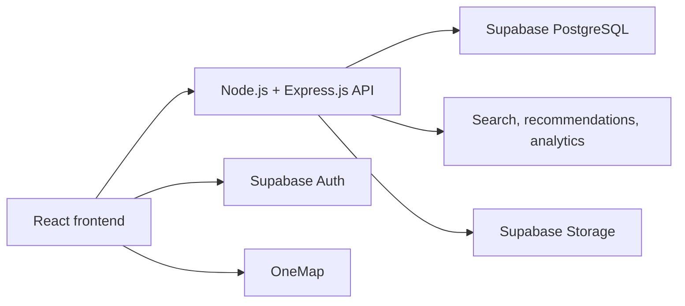

# Mixology — Low-Level Design

> **Status:** PHASE 1  
> **Version:** 1.1  
> **Date:** 2026-08-15  
> **Related document:** [High-Level Design](./HIGH_LEVEL_DESIGN.md)  

## 1. Document purpose

This document describes the detailed implementation design for the Mixology web application, with the cocktail-learning detail experience as the primary Phase 1 product flow.

It records the current component structure and identifies the concrete implementation behavior required for the next functional version. It is intentionally editable. Sections marked `TODO`, `Proposed`, or `Future` require product or engineering decisions before implementation.

## 2. Implementation baseline

### Current stack

- React 19.
- React DOM 19.
- Vite.
- JavaScript/JSX application files.
- TypeScript configuration present for tooling and configuration files.
- Tailwind CSS v4 available through the Vite plugin.
- Most existing component styling implemented with inline style objects.
- Fraunces and Inter loaded through Google Fonts.
- Static data stored in JavaScript modules.

### Current entry points

- [`src/main.jsx`](../src/main.jsx): React entry point.
- [`src/App.jsx`](../src/App.jsx): application shell and page state.
- [`src/index.css`](../src/index.css): global styles, fonts, colors, and theme tokens.

### Current navigation model

The application does not currently use a routing library. `App.jsx` stores the active page as a string:

```js
const [page, setPage] = useState('home')
```

Current page values:

```text
home
quiz
explorer
bars
cocktail
```

The current `cocktail` page is opened by selecting a cocktail card. The selected cocktail object and the originating page are stored in `App.jsx` so the back action can return the user to Home or Explorer.

### Phase 1 routing target

Phase 1 will replace the local page-only navigation for detail pages with URL-based routing:

```text
/
/quiz
/cocktails
/cocktails/:cocktailId
/bars
/bars/:barId
/search
```

Phase 1 routing requirements:

- Cocktail cards open `/cocktails/:cocktailId`.
- Bar cards and map previews open `/bars/:barId`.
- Search can route directly to an exact cocktail or bar match.
- Browser refresh and direct links preserve the selected detail page.
- Back navigation preserves the previous Explorer search and filter context where practical.

The current local page state remains the prototype implementation. The Phase 1 routing work should move the selected cocktail and bar identity from in-memory objects to stable URL identifiers.

### Phase 1 backend and database boundary

Phase 1 will use a backend and database. The browser frontend will not be the production source of truth.



Phase 1 responsibilities:

- The frontend renders screens and sends user actions to the API.
- The Node.js/Express.js API validates requests and applies business rules.
- Supabase PostgreSQL stores cocktails, bars, promotions, preferences, and approved activity.
- Supabase Auth provides account creation, login, and authenticated sessions.
- Quiz submission, preference storage, and personalized recommendations require an authenticated user.
- Recommendation and search logic operate through the API boundary.
- Analytics events are accepted only after the event list and privacy expectations are approved.
- Static JavaScript data remains available as local fixtures and initial seed data, not as the production source of truth.

Phase 1 will use authenticated Supabase Auth users for the personalized experience. Anonymous visitors may browse public cocktail and bar content, but they cannot submit the quiz, save preferences, or receive account-based recommendations until they sign in.

## 3. Repository structure

```text
src/
├── App.jsx
├── main.jsx
├── index.css
├── components/
│   ├── Navbar.jsx
│   ├── CocktailCard.jsx
│   └── Cocktail3DViewer.jsx
├── pages/
│   ├── HomePage.jsx
│   ├── QuizPage.jsx
│   ├── ExplorerPage.jsx
│   ├── CocktailDetailPage.jsx
│   └── BarsPage.jsx
├── data/
│   ├── cocktails.js
│   ├── cocktailDetails.js
│   └── cocktails.ts
└── imports/
    ├── mixology-figma-prompt.md
    └── mixology-quiz-figma-update.md
```

### Phase 1 target backend structure

The existing `src/` structure describes the current frontend prototype. The Phase 1 backend can be organized separately so server logic, database access, and frontend rendering remain independent:

```text
server/
  app.js
  routes/
  controllers/
  services/
  repositories/
  middleware/
  db/

supabase/
  migrations/
  seed/
```

- `server/` contains the Node.js/Express.js API.
- `routes/` maps HTTP endpoints to controller actions.
- `services/` contains recommendation, search, promotion, and preference rules.
- `repositories/` contains database queries and keeps Supabase details out of the UI.
- `middleware/` verifies Supabase Auth tokens and applies access control.
- `supabase/migrations/` contains versioned database changes.
- `supabase/seed/` contains initial cocktail, bar, and promotion data imported from the prototype fixtures.
- The Phase 1 frontend should add `src/pages/LoginPage.jsx` for Supabase Auth sign-in and account creation.

### Data-file note

The running JSX components import [`src/data/cocktails.js`](../src/data/cocktails.js). Cocktail view metadata is stored in [`src/data/cocktailDetails.js`](../src/data/cocktailDetails.js). These files are prototype fixtures only for Phase 1; the API and database will become the production source of truth. [`src/data/cocktails.ts`](../src/data/cocktails.ts) appears to be a duplicate and should either be removed, made authoritative, or converted into shared types.

> **TODO:** Choose one source of truth for cocktail and bar data.

## 4. Application shell design

### `App.jsx`

Responsibilities:

- Own the current page.
- Own the global search query.
- Own quiz completion answers.
- Render the correct page component.
- Hide the global navbar on the quiz page.
- Provide navigation callbacks.

Current state:

```js
const [page, setPage] = useState('home')
const [searchQuery, setSearchQuery] = useState('')
const [quizAnswers, setQuizAnswers] = useState(null)
const [selectedCocktail, setSelectedCocktail] = useState(null)
const [cocktailReturnPage, setCocktailReturnPage] = useState('explorer')
```

Current callbacks:

```text
handleQuizComplete(answers)
  1. Saves answers in App state.
  2. Navigates to home.

Navbar search submit
  1. Saves search query in App state.
  2. Navigates to explorer.

openCocktail(cocktail, returnPage)
  1. Saves the selected cocktail in App state.
  2. Saves whether the user came from home or explorer.
  3. Navigates to the cocktail view page.
```

Phase 1 target state:

```ts
type Page =
  | 'home'
  | 'login'
  | 'quiz'
  | 'explorer'
  | 'bars'
  | 'cocktail'
  | 'bar-detail'
```

The current implementation stores the selected cocktail object in state. A future URL-based implementation should store a stable cocktail identifier instead.

> **TODO:** Define whether detail-page identifiers should be stored in state or represented by URL parameters.

## 5. Navbar design

File: [`src/components/Navbar.jsx`](../src/components/Navbar.jsx)

### Responsibilities

- Render the Mixology logo.
- Navigate to Home, Cocktails, and Bars.
- Open and close the global search control.
- Submit a search query.

### Local state

```js
const [searchOpen, setSearchOpen] = useState(false)
const [query, setQuery] = useState('')
```

### Props

```text
currentPage: string
onNavigate(page): void
onSearch(query): void
```

### Current search behavior

- The search field is hidden until the search icon is selected.
- Submitting the form sends the query to `App.jsx`.
- The application navigates to the Explorer.
- The Explorer matches cocktail name, spirit, or bar name.

### Phase 1 search behavior

```text
1. Normalize the query.
2. Search cocktail names, bar names, spirits, tags, and other approved searchable fields.
3. If there is one clear exact match, open its detail page.
4. If there are multiple matches, show a results view grouped by cocktails and bars.
5. If there are no matches, show a useful empty state with a way to return to Explorer.
```

Phase 1 search requests should go through the application API, even if the API initially queries the production database directly. A dedicated search index can be added later without changing the frontend search interface.

> **TODO:** Select the Phase 1 search implementation and define the result-ranking rules.

## 6. Homepage design

File: [`src/pages/HomePage.jsx`](../src/pages/HomePage.jsx)

### Inputs

```text
onNavigate(page): void
quizAnswers: QuizAnswers | null
onSelectCocktail(cocktail): void
```

### Current sections

1. New-user or returning-user hero.
2. Your Go-To Cocktails, after quiz completion.
3. Popular in Singapore.
4. Browse by Taste.
5. Browse by Experience.
6. Featured Bar.

### Current derived data

```js
const featuredBar = bars[0]
const popularCocktails = cocktails.slice(0, 4)
const goToCocktails = cocktails.slice(0, 3)
const personalizedCocktails = cocktails.slice(2, 6)
```

The current “personalized” arrays are fixed slices and do not use recommendation scoring.

### Current card navigation

- Cocktail cards on the homepage receive an `onClick` callback.
- Selecting a card opens the cocktail view page.
- The source page is recorded so the detail page can return to Home.

### Phase 1 recommendation inputs

```ts
type RecommendationContext = {
  quizAnswers: QuizAnswers
  ratings?: UserRating[]
  viewedCocktails?: UserActivity[]
  location?: UserLocation
}
```

### Phase 1 homepage behavior

- New visitors see a prominent invitation to explore cocktails, with the taste quiz presented as an optional supporting action.
- Completed quiz users see recommendations based on their answers.
- Popular cocktails remain a separate non-personalized section.
- Relevant bars can be derived from the recommended cocktails.
- The featured bar remains a distinct partner placement.

## 7. Quiz design

File: [`src/pages/QuizPage.jsx`](../src/pages/QuizPage.jsx)

### Quiz response model

```ts
type QuizAnswers = {
  spirit: string
  flavor: string
  strength: string
  occasion: string
}
```

### Questions

| Step | Key | Question |
|---:|---|---|
| 1 | `spirit` | What spirit do you reach for? |
| 2 | `flavor` | What flavor profile calls to you? |
| 3 | `strength` | How strong do you like it? |
| 4 | `occasion` | What’s the occasion, most often? |

### Current local state

```js
const [step, setStep] = useState(0)
const [answers, setAnswers] = useState({})
```

### Current interaction rules

- An unanswered question cannot advance.
- Selecting an option updates the answer for the current question.
- Back moves to the previous question.
- Back on question one returns to Home.
- Completing question four calls `onComplete(answers)`.
- Progress is calculated from the current step and whether that step is answered.

### Phase 1 validation and persistence

- Require an authenticated Supabase Auth session before allowing the user to start or submit the personalized quiz. Unauthenticated visitors should see a login or sign-up prompt.
- Validate that all required keys exist before submitting.
- Validate that each value belongs to the allowed option list.
- Return a structured response with a timestamp.
- Send the completed quiz response to the protected API through the `PreferenceStore` adapter.
- Restore the saved response when the user returns to the homepage.

## 8. Cocktail Explorer design

File: [`src/pages/ExplorerPage.jsx`](../src/pages/ExplorerPage.jsx)

### Inputs

```text
searchQuery: string
onSelectCocktail(cocktail): void
```

### Current filter state

```js
const [selectedFlavors, setSelectedFlavors] = useState([])
const [selectedSpirits, setSelectedSpirits] = useState([])
const [selectedOccasions, setSelectedOccasions] = useState([])
const [strength, setStrength] = useState('')
const [level, setLevel] = useState('')
const [sort, setSort] = useState('Popularity')
const [sidebarOpen, setSidebarOpen] = useState(false)
```

### Current filtering behavior

Currently implemented:

- Search by cocktail name, spirit, or bar name.
- Flavor filtering.
- Spirit filtering.
- A–Z sorting.
- Rating sorting.
- Active filter chips.
- Clear-all behavior.
- Empty state.

### Current card navigation

- Filtered cocktail cards receive an `onClick` callback.
- Selecting a card opens the cocktail view page.
- The source page is recorded so the detail page can return to Explorer.

Currently stored but not applied to results:

- Occasion.
- Alcohol strength.
- Experience level.

### Phase 1 filter model

```ts
type CocktailFilters = {
  flavors: string[]
  spirits: string[]
  occasions: string[]
  strength?: 'low' | 'medium' | 'strong'
  experienceLevel?: 'beginner' | 'intermediate' | 'advanced'
  search?: string
}
```

### Phase 1 filter semantics

```text
Within one filter group: OR
Across filter groups: AND
No selected values: do not restrict by that group
```

Example:

```text
Selected flavors: Citrus, Floral
Selected spirits: Gin

Result:
  flavor is Citrus OR Floral
  AND spirit is Gin
```

### Phase 1 sort model

```ts
type CocktailSort = 'popularity' | 'a-z' | 'newest' | 'rating'
```

Required data fields:

```text
popularityScore: number
createdAt: date
rating: number
```

> **TODO:** Define how popularity is calculated and whether “Newest” is based on cocktail creation date, listing date, or editorial publication date.

### Empty state

When no cocktails match the active search and filters:

```text
No cocktails match
Try removing a filter or changing your search.
```

### Phase 1 mobile behavior

- Desktop shows a sticky filter sidebar.
- Mobile shows a Filters button.
- Selecting Filters opens a bottom sheet.
- Closing the sheet preserves selected filters.
- The filter count reflects the number of active filter values.

> **TODO:** Add responsive CSS that changes the current desktop-only filter trigger into a visible mobile control.

## 9. Cocktail card design

File: [`src/components/CocktailCard.jsx`](../src/components/CocktailCard.jsx)

### Current props

```text
cocktail: Cocktail
featured?: boolean
onClick?: () => void
```

### Current behavior

- Displays an image.
- Displays name, rating, spirit, bar, and up to two tags.
- Supports hover background and image scaling.
- Shows a Featured badge when requested.
- Opens the cocktail view page when an `onClick` callback is provided.
- Supports keyboard activation with Enter and Space.

### Phase 1 props

```ts
type CocktailCardProps = {
  cocktail: Cocktail
  featured?: boolean
  onClick?: () => void
}
```

### Accessibility requirements

- The card should be a button or contain an accessible link.
- Keyboard activation should open the cocktail detail page.
- The image should have a meaningful alt value.
- Rating should be exposed as text, not only a decorative icon.

## 10. Cocktail view page design

File: [`src/pages/CocktailDetailPage.jsx`](../src/pages/CocktailDetailPage.jsx)

### Inputs

```text
cocktail: Cocktail
onBack(): void
onNavigate(page): void
```

For Phase 1, the page should receive a composed `CocktailDetail` record from the API rather than assembling educational content from separate frontend fixture files.

### Page layout

The page is organized into four main areas:

1. Back-navigation row.
2. Main detail hero:
   - Interactive 3D-style cocktail viewer on the left.
   - Taste profile below the viewer.
   - Cocktail name and place-of-birth card on the right.
   - Drinker profile, spirit, strength, and occasion facts below the identity card.
3. Serving-bar slideshow.
4. Full-width history card with read-aloud action.

### Phase 1 product priority

`CocktailDetailPage` is the primary learning experience in Phase 1. The page must provide enough history, taste, origin, and cocktail facts for a user to understand the drink without taking the taste quiz or logging in. Recommendations and bar discovery are supporting actions that can continue from this page.

### Current local state

```js
const [barIndex, setBarIndex] = useState(0)
const [isReading, setIsReading] = useState(false)
const [speechNotice, setSpeechNotice] = useState('')
```

### Detail metadata lookup

```js
const details = getCocktailDetails(cocktail.id)
```

The base cocktail record comes from [`src/data/cocktails.js`](../src/data/cocktails.js). Supporting view content comes from [`src/data/cocktailDetails.js`](../src/data/cocktailDetails.js).

### Displayed cocktail metadata

```ts
type CocktailDetailMetadata = {
  placeOfBirth: string
  origin: string
  tasteTitle: string
  tasteDescription: string
  tastingNotes: string[]
  whoDrinks: string
  strength: string
  occasion: string
  history: string
  readAloud: string
  servingBarIds: number[]
}
```

### Serving-bar slideshow behavior

- Resolves `servingBarIds` against the static `bars` collection.
- Falls back to the first bar if no relationship is available.
- Displays one active bar slide at a time.
- Supports previous and next controls.
- Supports direct selection using slide indicator buttons.
- Displays the bar image, name, neighborhood, vibe, and promotion.
- The “Explore the bars” action navigates to the Bars page.

### History read-aloud behavior

- Uses `window.speechSynthesis` and `SpeechSynthesisUtterance`.
- Reads `details.readAloud`, falling back to `details.history`.
- The button toggles between “Read it out” and “Stop reading.”
- Speech is cancelled when the page unmounts.
- An accessible live status communicates reading state or browser support errors.
- If speech synthesis is unsupported, the page displays a fallback notice.

## 11. Cocktail 3D viewer design

File: [`src/components/Cocktail3DViewer.jsx`](../src/components/Cocktail3DViewer.jsx)

### Purpose

Provide an interactive visual presentation of the cocktail without adding a 3D rendering dependency or requiring a model asset.

### Current implementation

- Uses CSS `perspective` and `transform-style: preserve-3d`.
- Builds the visual from glass, liquid, image, garnish, stem, base, and shadow layers.
- Uses the cocktail image as a visual texture inside the liquid.
- Chooses a liquid color based on the cocktail spirit.
- Supports pointer dragging to change X/Y rotation.
- Provides rotate-left, rotate-right, and reset controls.
- Includes a short instruction: “Drag to explore the serve from every angle.”

### Important boundary

This is a CSS-based 3D-style viewer, not a physically accurate 3D model viewer. It does not currently use Three.js, WebGL, GLB files, lighting models, or model loading.

### Proposed future model viewer

If a true 3D asset is required, the component boundary should remain similar:

```text
Cocktail3DViewer
  receives cocktail and viewer configuration
  loads a model or scene
  exposes pointer and keyboard rotation
  exposes reset and loading/error states
```

> **TODO:** Decide whether the CSS viewer is sufficient or whether production requires Three.js/WebGL and artist-created cocktail assets.

## 12. Bars page design

File: [`src/pages/BarsPage.jsx`](../src/pages/BarsPage.jsx)

### Current state

```js
const partnerBars = bars.filter(b => b.partner)
const [carouselIdx, setCarouselIdx] = useState(0)
const [hoveredPin, setHoveredPin] = useState(null)
const [selectedBar, setSelectedBar] = useState(null)
```

### Partner carousel

Current behavior:

- Uses partner bars only.
- Displays three visible cards when enough partner data exists.
- Uses previous and next buttons.
- Marks the first visible card with champagne styling.

Phase 1 target behavior:

- Support touch/swipe input.
- Handle fewer than three partner bars.
- Show an explicit placeholder when there are no partner bars.
- Make the View Bar button navigate to a bar detail page.

### Partner promotions and featured placements

Phase 1 will support partner visibility without requiring a self-service partner dashboard. Mixology administrators will create, review, update, activate, and expire partner-bar profiles and promotions on behalf of partner bars.

The long-term product direction is a partner portal that allows bars to maintain their own profiles and promotions while Mixology retains approval, quality, and featured-placement controls.

Partner bars may receive:

- A visible Partner or Featured badge.
- Featured placement on the homepage.
- Priority placement in the partner-bar carousel.
- Promotion badges on bar cards.
- Promotion details on the bar detail page.
- Promotion details on a cocktail page when the bar serves that cocktail.

Promotions may initially be stored in static data or managed through an internal Mixology administration workflow. Partner bars will provide the content, but will not directly edit the Phase 1 application data.

```ts
type Promotion = {
  id: string
  barId: string
  title: string
  description: string
  startsAt: string
  endsAt: string
  activeDays?: string[]
  startTime?: string
  endTime?: string
  callToAction: string
  terms?: string
}
```

The UI should show a promotion only when its current date and time are within the active period. Partner or sponsored placement should be labeled clearly so users can distinguish it from ordinary editorial discovery.

### Map

Current behavior:

- Uses a CSS-styled mock map.
- Uses manually assigned percentage positions.
- Displays all static bars.
- Opens a preview on hover or click.

Phase 1 target behavior:

- Use real latitude and longitude fields.
- Integrate OneMap for Singapore bar locations and map display.
- Cluster dense markers.
- Make pins keyboard accessible.
- Open bar details from the preview.
- Avoid relying on hover as the only interaction.

### Phase 1 bar model additions

```ts
type BarVibe = string

type Bar = {
  id: string
  name: string
  vibe: BarVibe
  neighborhood: string
  latitude: number
  longitude: number
  partner: boolean
  promo?: Promotion | null
  imageUrl?: string
}
```

### Bar detail page target

Phase 1 will add a dedicated bar page at `/bars/:barId`.

The page should display:

- Bar name, image, neighborhood, and vibe.
- Real map location and directions action.
- Partner status and active promotions.
- Cocktails served by the bar.
- A clear link back to the previous discovery context.

The page should use the same bar record and promotion model as the Bars page and the cocktail serving-bar slideshow.

## 13. Data models

### Current cocktail model

```ts
type Cocktail = {
  id: number
  name: string
  spirit: string
  flavor: string
  rating: number
  bar: string
  img: string
  tags: string[]
}
```

### Current cocktail detail metadata model

```ts
type CocktailDetailMetadata = {
  placeOfBirth: string
  origin: string
  tasteTitle: string
  tasteDescription: string
  tastingNotes: string[]
  whoDrinks: string
  strength: string
  occasion: string
  history: string
  readAloud: string
  servingBarIds: number[]
}
```

The detail metadata is keyed by the base cocktail ID and is resolved through `getCocktailDetails(id)`. A fallback metadata object is returned when a cocktail does not yet have a dedicated entry.

### Phase 1 cocktail model

```ts
type Cocktail = {
  id: string
  name: string
  description: string
  spirit: Spirit
  flavors: Flavor[]
  tags: string[]
  strength: Strength
  experienceLevel: ExperienceLevel
  occasions: Occasion[]
  rating: number
  popularityScore: number
  createdAt: string
  imageUrl: string
  servingBars: BarReference[]
}
```

### Phase 1 cocktail-learning detail model

The detail content is a first-class part of the product. The database may keep base cocktail fields and educational metadata in separate tables, but the API should return them as one detail response so the page can render the complete learning experience without treating history or taste information as optional.

```ts
type CocktailDetail = Cocktail & {
  detail: CocktailDetailMetadata
}
```

`CocktailDetailMetadata` should contain the cocktail’s place of birth or origin, taste title and description, tasting notes, drinker profile, strength, occasion, history, read-aloud text, and serving-bar relationships.

### Supporting enums

```ts
type Strength = 'low' | 'medium' | 'strong'
type ExperienceLevel = 'beginner' | 'intermediate' | 'advanced'
type Occasion = 'after-dinner' | 'first-date' | 'business-drinks' | 'weekend-unwind'
```

> **TODO:** Confirm the authoritative vocabulary for flavors, spirits, vibes, occasions, and experience levels.

## 14. Recommendation design

Recommendations are a supporting feature. Their purpose is to help an authenticated user choose which cocktail to learn about next; they should not replace the public cocktail detail experience.

### Current behavior

The post-quiz homepage uses fixed cocktail array slices. Quiz answers do not currently change the actual cocktail set.

### Phase 1 scoring behavior

```ts
type RecommendationInput = {
  quizAnswers: QuizAnswers
  cocktails: Cocktail[]
  userActivity?: UserActivity[]
  userRatings?: UserRating[]
}

type RecommendationResult = {
  cocktailId: string
  score: number
  reasons: string[]
}
```

Initial Phase 1 score components:

```text
Spirit match       25%
Flavor match       30%
Strength match     15%
Occasion match     15%
Popularity          5%
Rating              5%
View/activity data  5%
```

These weights are an initial proposal and should be reviewed before implementation. The service should return both a score and human-readable reasons so the UI can explain recommendations.

Example reason:

```text
Recommended because you chose Gin and Citrus & Bright.
```

Phase 1 rules should also define tie-breaking and cold-start behavior. A user’s quiz match should remain more important than a small amount of browsing activity.

### Phase 1 preference persistence

The application should remember the user’s quiz answers and basic discovery activity across refreshes.

The implementation should use a storage adapter so the UI does not depend directly on a specific storage system:

```ts
type PreferenceStore = {
  saveQuizAnswers(answers: QuizAnswers): void
  getQuizAnswers(): QuizAnswers | null
  recordCocktailView(cocktailId: string): void
  getViewedCocktailIds(): string[]
}
```

For Phase 1, the primary adapter will use the backend API and Supabase database for authenticated users. Browser `localStorage` may be used only as a temporary cache or offline fallback; it is not the production source of truth. Anonymous visitors cannot save quiz answers or receive account-based personalized recommendations.

## 15. Navigation and detail pages

### Phase 1 route model

Phase 1 should use URL-based routing for shareable cocktail and bar pages:

```text
/
/login
/quiz
/cocktails
/cocktails/:cocktailId
/bars
/bars/:barId
/search
```

### Navigation requirements

- Unauthenticated users who select the quiz are sent to `/login`.
- Successful Supabase Auth login returns the user to the quiz or the original protected destination.
- Cocktail card opens `/cocktails/:cocktailId`.
- Bar card opens `/bars/:barId`.
- Map preview opens the corresponding bar detail page.
- Search result opens the matching entity.
- Back navigation preserves the previous search/filter context where practical.

> **TODO:** Choose the routing library and confirm the search-results URL format.

## 16. Phase 1 API boundary

The current prototype has no API. Phase 1 will introduce an application API so the frontend can use backend and database-backed data.

```text
GET    /api/v1/cocktails
GET    /api/v1/cocktails/:id
GET    /api/v1/bars
GET    /api/v1/bars/:id
GET    /api/v1/search?q={query}
POST   /api/v1/quiz-responses
GET    /api/v1/recommendations
GET    /api/v1/promotions
GET    /api/v1/me/preferences
PUT    /api/v1/me/preferences
POST   /api/v1/me/activity
POST   /api/v1/analytics/events

Internal administration endpoints:
GET    /api/v1/admin/bars
POST   /api/v1/admin/bars
PUT    /api/v1/admin/bars/:id
POST   /api/v1/admin/bars/:id/promotions
PUT    /api/v1/admin/promotions/:id
GET    /api/v1/admin/analytics/summary
GET    /api/v1/admin/analytics/events
```

Example Explorer request:

```text
GET /api/v1/cocktails?flavor=citrus&spirit=gin&sort=rating&page=1&pageSize=24
```

Phase 1 API requirements:

- Validate all incoming query and body values.
- Require a valid Supabase Auth bearer token for quiz, preference, activity, recommendation, and administration endpoints.
- Apply authorization to internal administration endpoints.
- Return stable IDs for cocktails, bars, promotions, and authenticated users.
- Support pagination for cocktail, bar, and search results.
- Return a consistent JSON error format with a user-facing message of `Something went wrong.` for unexpected failures.
- Log technical error details on the server without exposing them to the user.
- Keep recommendation and search logic behind server-side service boundaries.
- Version the API so future changes do not silently break the frontend.

### Cocktail detail response

`GET /api/v1/cocktails/:id` is a primary Phase 1 endpoint. It should return the complete educational content needed by `CocktailDetailPage` in one response:

```ts
type CocktailDetailResponse = {
  cocktail: Cocktail
  detail: CocktailDetailMetadata
  servingBars: BarSummary[]
}

type BarSummary = {
  id: string
  name: string
  neighborhood: string
  vibe: BarVibe
  partner: boolean
  imageUrl?: string
}
```

The response should include the cocktail’s history, read-aloud text, taste description, tasting notes, place of birth or origin, spirit, strength, occasion, drinker profile, visual media, and related bars. The frontend should not need to reconstruct the educational content from several unrelated static files in production.

Node.js and Express.js are the selected Phase 1 backend technologies. Supabase PostgreSQL, Supabase Auth, and Supabase Storage are the selected Phase 1 Supabase services. The production hosting provider remains undecided. The API error response should remain generic to users while server logs retain actionable technical details.

### Phase 1 database model

Supabase will provide the Phase 1 PostgreSQL database, authentication, and managed media storage. Supabase Auth manages user identities and sessions; the application must not write directly to Supabase Auth system tables.

Phase 1 should support these logical records:

```text
cocktails
cocktail_detail_metadata
bars
bar_cocktails
promotions
authenticated_users (Supabase Auth identities)
user_preferences
user_activity
analytics_events
```

Important relationships:

```text
bar_cocktails links bars to cocktails
promotions belong to bars
cocktail_detail_metadata belongs to cocktails
user_preferences belong to authenticated Supabase Auth users
user_activity belongs to authenticated Supabase Auth users
analytics_events may reference an authenticated user and an entity
```

Database requirements:

- Use stable IDs for all primary entities.
- Add created and updated timestamps to managed records.
- Store promotion start/end times and active status inputs.
- Add indexes for cocktail search fields, bar names, neighborhoods, and promotion status.
- Use migrations for schema changes.
- Back up production data and document restore procedures.
- Keep administrative changes auditable before the long-term partner portal is introduced.

### Phase 1 analytics and measurement

Mixology will build its own lightweight analytics dashboard for administrators. Approved events will be stored in the `analytics_events` table in Supabase and read through protected administration endpoints. The event list, data fields, and privacy expectations must still be discussed and approved before analytics is enabled for real users.

Candidate Phase 1 events:

```text
quiz_completed
cocktail_viewed
bar_viewed
recommendation_selected
serving_bar_selected
promotion_clicked
search_used
history_read_aloud
```

Example event payload:

```ts
type AnalyticsEvent = {
  event: string
  entityId?: string
  source?: string
  timestamp: string
}
```

Phase 1 tracking rules:

- Track product actions, not every mouse movement or hover.
- Avoid collecting names, message contents, or unnecessary personal information.
- Do not use session recording or advertising profiles.
- Approve the final event list and privacy expectations before implementation.
- Restrict analytics summary and event-detail views to Mixology administrators.
- Build the initial dashboard around counts and trends for discovery, search, views, recommendations, and promotion interactions.
- Add advanced reporting, segmentation, and exports only after enough usage data exists.

The purpose is to understand whether the quiz-to-cocktail-to-bar journey is working, not to build a detailed personal profile of each user. Events may reference an authenticated user only where that is necessary and approved; otherwise, store aggregate or minimally identifiable data.

## 17. Error, loading, and empty states

### Global states

- Loading: show a quiet skeleton or reserved layout area.
- Error: show `Something went wrong.` and provide a retry action without exposing technical server details.
- Empty: explain that no data or matching results are available.
- Missing image: use a neutral cocktail/bar placeholder.

### Explorer states

- No matches after filtering.
- Search service unavailable.
- Cocktail data unavailable.

### Cocktail view states

- Cocktail metadata is missing: use the fallback metadata object.
- Cocktail image unavailable: keep the viewer frame and show the neutral background.
- No related serving bars: show the configured fallback bar or an explicit empty state.
- Speech synthesis unavailable: keep the history text visible and show a support notice.
- Speech synthesis interrupted: reset the read-aloud button to its idle state.

### Bars states

- No partner bars.
- Fewer than three partner bars.
- Map provider unavailable.
- Bar has no active promotion.

## 18. Accessibility and responsive requirements

### Accessibility

- Use semantic headings in page order.
- Use real buttons or links for interactive cards.
- Keep focus indicators visible.
- Ensure quiz options expose selected state to assistive technology.
- Use labels for all select controls.
- Make map pins keyboard reachable.
- Provide non-hover alternatives for map previews.
- Make cocktail cards keyboard activatable.
- Provide rotate-left, rotate-right, and reset controls for the 3D-style viewer.
- Keep the history readable as text even when speech synthesis is unavailable.
- Announce read-aloud state changes through an accessible live region.
- Check text and control contrast against the dark theme.

### Responsive behavior

```text
Desktop:
  Two-column homepage hero.
  Sticky Explorer sidebar.
  Three-card partner-bar carousel.

Tablet:
  Reduced gaps and card widths.
  Flexible card grids.

Mobile:
  Single-column homepage hero.
  Mobile filter button and bottom sheet.
  Horizontally scrollable or stacked partner cards.
  Stacked cocktail detail hero with full-width viewer.
  Full-width serving-bar slide and history card.
  Full-width primary actions.
```

## 19. Testing plan

### Unit tests

- Filter matching.
- Search matching.
- Sort behavior.
- Recommendation scoring.
- Quiz progress calculation.
- Carousel wraparound.
- Cocktail detail metadata lookup.
- Recommendation reason generation.

### Component tests

- Quiz cannot advance without an answer.
- Quiz submits all four answers.
- Filter chip removes only its own value.
- Clear-all resets every filter.
- Empty Explorer state appears when appropriate.
- Cocktail card invokes its selection behavior.
- Cocktail card supports Enter and Space activation.
- Cocktail view renders the selected cocktail metadata.
- Cocktail view changes serving-bar slides.
- Read-aloud action starts and stops speech when supported.
- Bar pin opens the correct preview.

### End-to-end tests

- Public visitor opens a cocktail detail page, reads its history, and uses read-aloud without logging in.
- New user creates an account, completes the quiz, and sees a returning homepage with personalized recommendations.
- User searches for a cocktail.
- User applies multiple filters.
- User opens a cocktail detail page.
- User rotates the cocktail viewer and resets its position.
- User moves through bars serving the selected cocktail.
- User reads the cocktail history aloud.
- User opens a bar from the map.
- User uses the filter controls on a mobile viewport.

## 20. Implementation sequence

### Completed in the current prototype

- Added cocktail-card navigation into the cocktail view page.
- Added selected-cocktail and return-page state to `App.jsx`.
- Added cocktail detail metadata and serving-bar relationships.
- Added the CSS-based interactive 3D-style viewer.
- Added taste, origin, drinker profile, spirit, strength, and occasion sections.
- Added the serving-bar slideshow.
- Added the cocktail history card and browser read-aloud action.
- Added responsive styling and keyboard interactions for the new page.

### Phase 1 implementation sequence

1. Set up the Node.js/Express.js API project and Supabase PostgreSQL, Auth, and Storage services, then confirm the API hosting approach.
2. Define the versioned Phase 1 API contract, logical database schema, migration strategy, and data ownership rules.
3. Implement the API and Supabase data-access layer, including migrations, backups, and seed/import scripts based on the current static fixtures.
4. Select one authoritative domain model and define shared types for cocktail details, history, taste, spirits, flavors, occasions, strengths, and levels.
5. Seed the first-class cocktail-detail data and implement `GET /api/v1/cocktails/:id` as a composed educational detail response.
6. Connect frontend repositories to the API. Keep static JavaScript data only as local development fixtures, test data, or migration seed data.
7. Replace local cocktail object navigation with URL-based routing, including `/login` and `/cocktails/:cocktailId`.
8. Make `CocktailDetailPage` API-backed and complete the core learning flow: visual viewer, taste profile, facts, serving bars, history, and read-aloud.
9. Complete Explorer filtering, sorting, and direct search for cocktails and bars.
10. Add explicit popularity and creation-date fields for discovery ranking.
11. Implement recommendation scoring using quiz answers and approved user activity behind the API boundary.
12. Require Supabase Auth for the quiz and persist quiz answers and discovery history through the backend storage adapter.
13. Add bar detail navigation and the Phase 1 bar detail page.
14. Replace the mock map with OneMap and coordinate-based markers.
15. Add Phase 1 partner-promotion rules, active-date validation, and clear partner labels.
16. Add responsive CSS for the mobile Explorer filter control.
17. Agree on the analytics event list and privacy expectations with stakeholders.
18. Implement the approved lightweight analytics events in Supabase and expose the Mixology-admin analytics dashboard through protected API endpoints, then add tests for authentication gates, API validation, database migrations and seed data, Supabase Storage access, cocktail detail rendering, filtering, recommendations, navigation, OneMap interactions, viewer controls, partner promotions, analytics events, read-aloud, and responsive behavior.

### Later-phase implementation

- Evaluate whether the CSS viewer should be replaced with a true 3D model viewer.
- Add advanced analytics reporting, segmentation, and exports.
- Build a long-term partner portal/business dashboard for profile maintenance.
- Allow partner bars to update their profiles, cocktail listings, images, and promotions.
- Add Mixology review, approval, publishing, and audit controls for partner changes.
- Add advanced partner promotion scheduling and management.
- Evaluate cocktail ordering, delivery, and reservations.
- Evaluate payments, subscriptions, and other commercial workflows.
- Evaluate user-generated recipes and social features.
- Evaluate full customer relationship management for bars.
- Evaluate alcohol sales and age-verification workflows subject to product, security, and legal review.

## 21. Open implementation decisions

| Topic | Current behavior | Proposed decision | Owner | Status |
|---|---|---|---|---|
| Product priority | Feature flow is not yet ranked | Cocktail detail and education first; quiz, recommendations, and bars support it | TODO | Confirmed |
| Routing | Local page string | Phase 1 URL-based routing | TODO | Planned |
| Backend/API | No backend in prototype | Node.js/Express.js Phase 1 application API | TODO | Confirmed |
| Database | No database in prototype | Supabase PostgreSQL Phase 1 production database | TODO | Confirmed |
| Data source | Static JavaScript | API/database source of truth; static fixtures for development | TODO | Planned |
| Backend framework | Not applicable in prototype | Node.js and Express.js | TODO | Confirmed |
| Database engine | Not applicable in prototype | Supabase PostgreSQL | TODO | Confirmed |
| Identity/authentication | No user identity | Supabase Auth; login required for quiz and personalized recommendations | TODO | Confirmed |
| Type system | JSX with duplicate TS data | TODO | TODO | Open |
| Search | Explorer filtering | Phase 1 direct cocktail/bar results | TODO | Planned |
| Recommendations | Fixed array slices | Phase 1 scoring from quiz and activity | TODO | Planned |
| Map | CSS mock map | OneMap with real coordinates | TODO | Confirmed |
| Media storage | External image URLs | Supabase Storage for Mixology-managed media | TODO | Confirmed |
| Cocktail detail metadata | Static `cocktailDetails.js` | Phase 1 data adapter or API source | TODO | Planned |
| 3D viewer | CSS-based presentation | Keep CSS viewer in Phase 1; true model later | TODO | Planned |
| History narration | Browser Web Speech API | Keep as optional Phase 1 enhancement | TODO | Planned |
| Bar detail page | Not implemented | Phase 1 bar detail route and page | TODO | Planned |
| Partner promotions | Static partner flag and promo | Phase 1 static/admin-managed active promotions | TODO | Planned |
| Partner profile ownership | Mixology-managed in Phase 1 | Long-term partner portal with Mixology approval | TODO | Long term |
| Mobile filters | Bottom-sheet code present but trigger hidden | Complete Phase 1 responsive behavior | TODO | Planned |
| Analytics events | Not implemented | Approve event list, store events in Supabase, and provide a Mixology-admin dashboard | TODO | Pending approval |
| Advanced analytics | Not implemented | Later-phase reporting, segmentation, and exports | TODO | Later |

## 22. Definition of done for the design

- [ ] Current behavior is accurately documented.
- [ ] Phase 1 target behavior is clearly distinguished from current behavior.
- [ ] All `TODO` decisions have an owner.
- [ ] Data models are approved.
- [ ] Filter and recommendation semantics are approved.
- [ ] Navigation and URL behavior are approved.
- [ ] Persistence approach is approved.
- [ ] Supabase Auth login requirements and Supabase Storage access rules are approved.
- [ ] OneMap provider and coordinate model are approved.
- [ ] Partner-promotion rules are approved.
- [ ] Analytics events and privacy expectations are approved before tracking is enabled.
- [ ] Responsive and accessibility requirements are testable.
- [ ] Phase 1 API boundaries, hosting provider, and database operations are approved.
- [ ] True model-based 3D and advanced analytics are recorded as later-phase decisions.
- [ ] Engineering reviewers agree that the document is implementable.
